# Dungeonfront — Monster, Boss & Combat Effect Sprite Preview

These are **actual generated PNG sprite sheets committed to the unreleased development branch**, not concept art. Each PNG is a horizontal strip of animation frames (transparent, indexed pixel art), automatically selected by the dungeon renderer. The original Dabski intro and local save identifier are unchanged.

## 8 regular monsters + raid boss

| Dungeon enemy | Idle (4) | Attack (6) | Death (6) |
|:--|:--|:--|:--|
| **Cave Slime** | 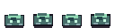 | 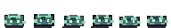 |  |
| **Goblin Scout** | 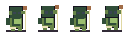 | 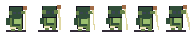 |  |
| **Bone Sentinel** | 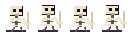 | 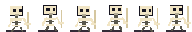 |  |
| **Ember Imp** | 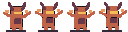 | 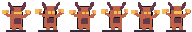 |  |
| **Crypt Spider** |  |  |  |
| **Drowned Wraith** | 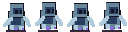 | 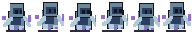 |  |
| **Abyss Hound** | 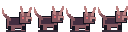 | 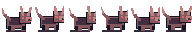 | 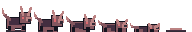 |
| **Hollow Guardian** |  | 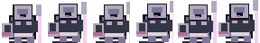 |  |
| **Abyssal Sovereign** | 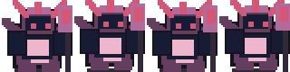 |  |  |

Each enemy also has walking and hurt animations. The **Abyssal Sovereign** has a dedicated six-frame special attack:

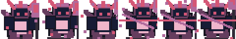

## Eight combat effects

| Effect | Animated pixel sheet |
|:--|:--|
| **slash** | 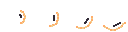 |
| **heavy slash** | 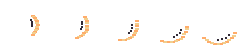 |
| **arrow** |  |
| **magic bolt** |  |
| **healing pulse** |  |
| **hit flash** |  |
| **critical** |  |
| **death burst** | 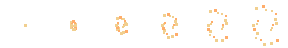 |

## Runtime integration

- Monster sheets match the nine existing `DFDungeon.monsterKinds` indices; no monster or save reset.
- One-time attack pulses, ranged spells, healing, critical hits, contact flashes and monster deaths are driven by simulation state, not free-running CSS effects.
- Monsters play their death animation briefly while combat still treats them as defeated. Victorious raiders continue toward the entrance-side extraction portal; the final raid floor still has no far-end passage.
- `sprite-system.js` falls back to the existing procedural monster/effect visuals if a PNG cannot be read.
- Tests verify PNG signatures, frame sizes, transparency, unique frames and the existing contract extraction rules. Android device playtesting remains pending.

**Build status:** no Android APK has been generated for this work.
