# Dungeonfront — Adventurer Sprite Preview

These are the **actual shipped PNG sprite sheets** on the unreleased development branch, not concept images. Each sheet contains horizontally aligned transparent 32×48 frames. GitHub may display them at their native small size; open an image for full-resolution inspection.

| Class | Idle (4 frames) | Walk (6 frames) | Attack (6 frames) |
|:--|:--|:--|:--|
| **Knight** | 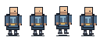 | 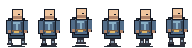 | 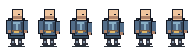 |
| **Ranger** | 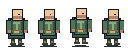 | 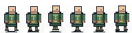 | 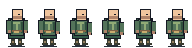 |
| **Mage** | 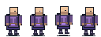 | 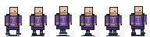 | 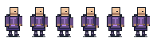 |
| **Cleric** | 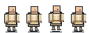 | 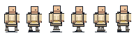 | 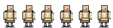 |
| **Rogue** | 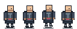 | 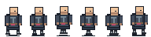 | 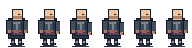 |
| **Mercenary** | 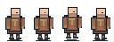 | 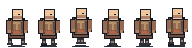 | 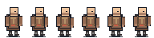 |

The game loads these assets via `sprite-system.js`, using current hand-drawn silhouettes as a fallback if any sprites fail. Animations currently cover idle, walking/returning, and basic attacks; hurt, death, and class-specific signature sheets will follow.

**Quality checks:** `node tests/sprites.test.js` verifies the PNG signature, each frame-grid dimension, indexed transparency, and meaningful differences between animation frames.

**APK status:** no Android APK built for this development-only art pass.
